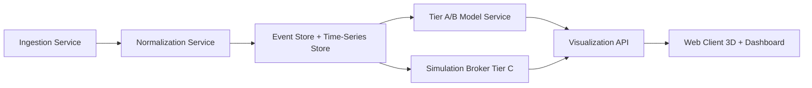

# 3D CME Simulation and Visualization App Plan (Sun → Earth)

## Executive Summary

This plan defines a production-ready path for evolving the current CME modeler into a three-tier forecasting and visualization platform:

- **Tier A (seconds):** Drag-based analytic propagation (DBM/DBEM-style) for interactive arrival windows and uncertainty envelopes.
- **Tier B (minutes):** Enhanced parametric interactions (CME–CME, CME–HSS/CIR, HCS-guided deflection/rotation heuristics).
- **Tier C (hours+):** Optional ingestion of external high-fidelity MHD outputs (e.g., WSA–ENLIL, EUHFORIA, SWMF/Geospace) for replay, benchmarking, and analyst workflows.

The architecture is intentionally split between low-latency UX and asynchronously integrated high-fidelity products.

---

## Product Modes

### 1) Researcher mode
- Historical case replay and reproducibility metadata.
- Batch ensemble runs, export of inputs/outputs, and model version tracking.
- Side-by-side validation against observations and Tier C outputs.

### 2) Forecaster mode
- Near-real-time ingestion and alerting.
- Immediate Tier A/B probabilistic outputs.
- Earth/L1 arrival windows and impact confidence indicators.

### 3) Public mode
- Simplified 3D narrative view.
- Reduced controls and clear uncertainty messaging.
- Aurora probability overlay and interpreted “what this means” summaries.

---

## Functional Requirements

### Inputs (MVP)
- CME launch time, speed, direction, and angular width.
- Background solar wind speed estimate for drag model.
- Optional imagery overlays from solar observatories.

### Outputs (MVP → Phase 3)
- 3D heliosphere scene with animated CME front/sheath/ejecta.
- Arrival-time PDF and confidence intervals at Earth/L1.
- Time-distance plot with ensemble spread.
- Optional geomagnetic proxy outputs (Kp/Dst-style indicators).
- Aurora probability overlays from operational feeds.

---

## Modeling Stack

## Tier A: Interactive Kinematics (Default)

- Use DBM equation of motion:

\[
 a(t) = -\gamma\,(v-w)\,|v-w|
\]

- Maintain closed-form propagation for fast ensemble performance.
- Support cone geometry baseline; expose uncertainty sliders for:
  - initial speed \(v_0\)
  - drag parameter \(\gamma\)
  - ambient wind \(w\)
  - direction and angular width

**Target:** 1,000-member ensembles in 1–3 s on CPU.

## Tier B: Enhanced Parametric Interactions

- **CME–CME:** overlap detection + merge/overtake toggle.
- **CME–HSS/CIR:** position-dependent background wind and compression effects.
- **HCS influence:** simple deflection tendency toward modeled current sheet.
- **Rotation/deflection:** ForeCAT-inspired heuristic coefficients sampled in ensembles.
- **Magnetic erosion scalar:** decays predicted ejecta field envelope with distance.

## Tier C: External MHD Integration

- Add simulation broker to ingest precomputed or queued runs.
- Store run metadata and align timebases for synchronized replay.
- Treat queued results as asynchronous “high-fidelity layer,” not real-time forecast core.

---

## Data Ingestion Plan

### Priority data providers
1. **Event catalog/API source** for CME parameters and linked events.
2. **Real-time operational feeds** for Kp-like and aurora products.
3. **Imagery provider** for coronagraph/EUV context frames.
4. **Standardized in-situ timeseries APIs** for historical validation.

### Ingestion service responsibilities
- Poll each source on source-appropriate cadence.
- Normalize timestamps to UTC and canonical internal schema.
- Add source provenance and retrieval timestamp to every record.
- Cache “last good state” for resilience during endpoint outages.

---

## System Architecture

### Services
- **Ingestion:** fetches catalogs, solar wind, aurora, and imagery metadata.
- **Normalization:** coordinate/time unification and schema mapping.
- **Model service:** executes Tier A/B ensembles.
- **Simulation broker:** tracks Tier C run lifecycle and output retrieval.
- **Visualization API:** serves scene states, meshes, and chart-ready products.

---

## 3D/UX Specification

### Scene primitives
- Sun + reference axes.
- Parker spiral visual scaffold.
- CME shock/sheath/ejecta layers.
- Optional HCS surface and HSS/CIR sectors.

### Controls
- Global timeline (real-time + replay + time warp).
- Camera presets (heliocentric, Earth view, L1).
- Layer toggles (CME structures, HCS/HSS, uncertainty cloud).

### Multi-panel layout
- 3D scene.
- Arrival PDF and confidence panel.
- Time-distance chart.
- In-situ timeseries panel.
- Earth impact/aurora panel.

---

## Data Model (Internal)

### Event object
- `event_id`, `event_type`, `source`, `source_id`
- `launch_time`, `direction`, `width`, `speed`
- `confidence`, `notes`, `provenance`

### Ensemble object
- `ensemble_id`, `seed`, `model_version`
- parameter priors/ranges
- summary stats and distribution artifacts

### Tier C run object
- `run_id`, `provider`, `submit_time`, `status`
- `config_hash`, `output_refs`, `ingested_time`

---

## Validation Strategy

### Benchmark classes
- Fast extreme events (CME–CME dominated).
- Stream-interaction enhanced geomagnetic storms.
- Complex ejecta sequences with uncertain arrival structure.

### Metrics
- Arrival-time ME/MAE/RMSE.
- Hit/miss/false alarm rates for impact threshold.
- Probabilistic coverage and CRPS.
- Proxy correlation for Kp/Dst-like outputs.

### Reproducibility requirements
- Immutable run metadata.
- Persist random seeds and parameter priors.
- Persist source snapshots or retrieval references.

---

## Phased Implementation Roadmap

### Phase 1 (MVP, ~4–7 person-months)
- Tier A DBM ensemble engine.
- Unified event object ingestion.
- Basic cone-based 3D propagation and arrival PDF.

### Phase 2 (Interactions, ~6–10 person-months)
- Tier B interaction heuristics.
- GCS-like geometry editor for analyst mode.
- Export and replay workflows.

### Phase 3 (Integration, ~8–14 person-months)
- Tier C simulation broker + high-fidelity overlay ingestion.
- Advanced geospace/aurora overlay integration.
- Full provenance + skill score dashboards.

---

## Engineering Notes for This Repository

1. Keep current `SimulationCanvas` as the render core and introduce a dedicated scene-state adapter layer for model outputs.
2. Add a model abstraction (`TierAModel`, `TierBModel`, `TierCSource`) to avoid coupling UI to any one forecast source.
3. Implement feature flags for Tier B/Tier C to preserve existing user experience while new layers are validated.
4. Add a run-history drawer for replay and forecast comparison workflows.

